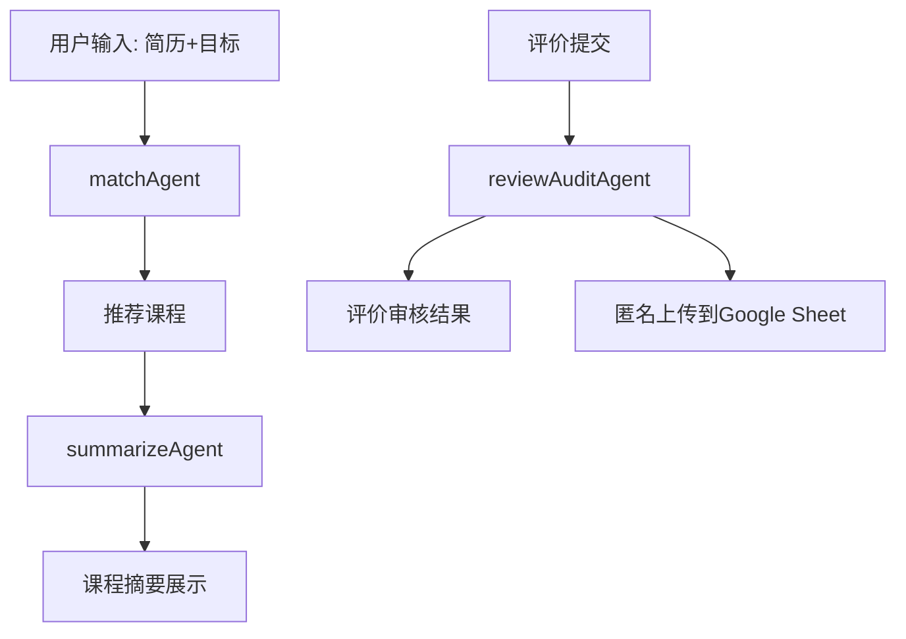

# ARCHITECTURE.md

## Overview

**CMU Course Assistant** 是一个 Chrome 扩展，专为帮助学生智能筛选与匿名评价 CMU 课程而设计。系统高度模块化，核心功能均通过 side panel 实现（**请特别注意：本扩展只采用 side panel 架构，绝无 popup！**）。
本项目融合本地静态课程数据、基于经典算法的本地推荐引擎，以及用户可选配置的 LLM API（如 Gemini）提升摘要和审核体验，所有数据流和核心功能均无后端依赖，隐私合规。

***

## File \& Directory Structure

```plaintext
cmu-course-assistant/
│
├── manifest.json
├── frontend/
│   ├── sidepanel.html         # 主入口，所有核心UI均为side panel展现
│   ├── frontend_example.html  # 完整交互&样式示例
│   ├── styles.css
│   ├── sidepanel.js
│   ├── settingsModal.html     # Gemini API Key 配置入口
│
├── data/
│   ├── courses.json           # 静态课程库
│
├── agents/
│   ├── index.js               # agent调度总线
│   ├── matchAgent.js          # 课程推荐，纯本地TF-IDF算法
│   ├── summarizeAgent.js      # 课程摘要，自动调用Gemini API（用户可自定义）
│   ├── reviewAuditAgent.js    # 智能审核，自动调用Gemini API（用户可自定义）
│   ├── agentUtils.js
│
├── storage/
│   ├── chromeStorage.js       # 本地存储实现
│   ├── sheetApi.js            # 评价上传功能
│
├── scripts/
│   ├── background.js
│
├── utils/
│   ├── idUtils.js
│   ├── auth.js
│   ├── llmConfig.js           # LLM接口配置（自定义API key管理）
│
├── package.json
├── ARCHITECTURE.md
├── README.md
└── ...
```


***

## Frontend UI: Side Panel

- **全部界面均在 sidepanel.html 和 sidepanel.js 实现，Chrome sidebar（侧边栏）原生支持**
- 所有用户交互、课程推荐/摘要/评价写入/审核都在侧边栏完成，**绝无 popup 设计！**
- UI 支持多tab视图：推荐、贡献/评价、结果展示，一键切换
- settingsModal.html 提供 Gemini API Key 配置入口（仅侧边栏 settings tab 可访问）

***

## Core Agent Modules \& API Dependencies

| Agent Name | 功能描述 | 是否依赖 Gemini API | 用户是否需配置API | 说明 |
| :--: | :--: | :--: | :--: | :--: |
| `matchAgent` | 课程智能匹配（推荐） | 否 | 否 | 全本地，TF-IDF/余弦/关键词等经典算法，无需AI或云端 |
| `summarizeAgent` | 个性课程摘要（自定义prompt） | 是（可选） | 是 | 默认用Gemini API生成摘要，未配置则降级为本地模板 |
| `reviewAuditAgent` | 课程评价审核（敏感词/质量） | 是（可选） | 是 | 默认用Gemini API审核，无API则本地规则审核 |


***

### API Key 配置与降级方案

- **用户可在 side panel 内的 settingsModal.html tab 输入自己的 Google Gemini API Key**，所有密钥仅本地存储，无任何外发
- 如果未填写，摘要和审核 agent 降级为本地模板或规则，但主推荐功能不受影响

***

## Modular Agent System

| Agent Name | 功能责任 | 输入 | 输出 | 备注（Highlights） |
| :--: | :--: | :--: | :--: | :--: |
| `matchAgent` | 课程匹配（纯本地、必需核心） | 用户简历、技能、目标、课程库 | 推荐课程列表 | 本地TF-IDF，无AI依赖（必须功能） |
| `summarizeAgent` | 课程摘要（自定义大模型，用户可选用API） | 课程描述、用户目标等 | 课程摘要字符串 | 默认用Gemini API，自定义API配置 |
| `reviewAuditAgent` | 评价审核（敏感词/质量，用户可选用API） | 评价文本 | 审核结果 | 默认用Gemini API，自定义API配置 |


***

## System Flow



- 推荐、摘要、审核三大核心agent均在 side panel 展现与驱动

***

## Data \& Privacy

- 课程数据：本地静态 `courses.json`
- 用户ID和简历信息：匿名 UUID，只本地存储
- 评价上传：仅评价内容+UUID hash，绝无真实邮箱/身份外泄
- 所有API Key、敏感配置：仅本地持有

***

## Setup / Extending Notes

- 仅需本地环境和前端依赖，无需服务器
- 新 agent 或功能，直接扩展 `/agents/` 并在 `index.js` 注册即可
- 推荐算法可随时升级至本地 embedding，主流程绝无外部大模型依赖

***

## FAQ \& Highlights

- **本项目所有核心功能在 Chrome side panel 实现，绝无 popup！**
- 课程推荐 agent 完全本地、开箱即用，不依赖任何 AI 或 LLM
- Gemini API 仅用于摘要/审核，非常容易配置，未填写不影响主流程
- 所有数据本地保护，评价匿名上传，无后台服务器

***
